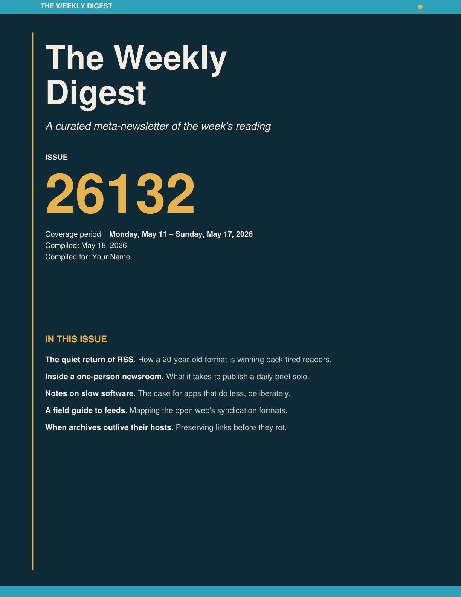
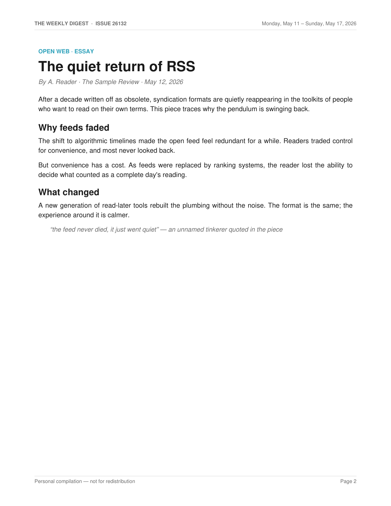

# Weekly Newsletter Digest

A [Claude Code](https://claude.com/claude-code) **skill** that compiles a week's reading into a single, designed PDF "meta-newsletter" — a navy/teal/gold magazine-style cover, story-by-story summaries, and a clickable bibliography.

It pulls from two sources for a given Monday–Sunday week:

1. **Gmail** — emails tagged with a `News Letter` label.
2. **Reeder** — articles saved to a [Reeder](https://reederapp.com/) read-later shared feed.

Stories from both sources are summarized, de-duplicated (Gmail wins), mixed together by date, and rendered into one PDF.

> This repository is published as a **reference example** of how to structure a multi-source, document-producing Claude Code skill. The feed URL, recipient name, and account-specific IDs have been replaced with placeholders — see [Setup](#setup).

## Sample output

Rendered from synthetic placeholder content — no real names, articles, or subscriptions.

| Cover | Inner page |
|---|---|
|  |  |

## What's in here

```
weekly-newsletter-digest/
├── SKILL.md                      # the skill: workflow, rules, and phase-by-phase instructions
├── references/
│   └── content_schema.md         # authoritative schema for the content dict the renderer consumes
└── scripts/
    ├── build_pdf.py              # ReportLab rendering engine (locked design)
    └── reeder_read_later.py      # zero-dependency fetcher for a Reeder shared JSON Feed
```

## How it works

The skill runs in five phases (detailed in [`SKILL.md`](weekly-newsletter-digest/SKILL.md)):

1. **Fetch** newsletter emails from Gmail for the target week.
2. **Fetch** read-later articles from the Reeder shared feed, filtered to the same week.
3. **Extract & summarize** each story in original prose; fetch full text for link-only items.
4. **Compose** a structured content dict matching [`content_schema.md`](weekly-newsletter-digest/references/content_schema.md).
5. **Render** the PDF via `build_pdf.py`.

The PDF layout is intentionally **locked** — palette, cover coordinates, typography, and page chrome are part of the deliverable and aren't meant to be improvised per run.

## The Reeder fetcher

`scripts/reeder_read_later.py` is a standalone, standard-library-only fetcher for a Reeder shared JSON Feed (JSON Feed 1.1). It handles the endpoint's quirks: a 302 redirect to a compressed (gzip/deflate) body, and JSON Feed 1.0/1.1 author-field differences. It can be used on its own:

```bash
python3 scripts/reeder_read_later.py \
  --url https://reederapp.net/<your-feed-id>.json \
  --all --format jsonl --output read_later
```

Note the `.json` suffix is required on the shared-feed URL. The shared feed only holds the last ~50 items added to the tag, so run often enough that items don't roll off before capture.

## Setup

To adapt this for your own use, replace the placeholders:

| Placeholder | Where | Replace with |
|---|---|---|
| `https://reederapp.net/<your-feed-id>.json` | `SKILL.md` (Phase 2) | Your own Reeder shared-feed URL (publish a tag as a shared feed in Reeder) |
| `Your Name` | `SKILL.md`, `content_schema.md` | The recipient name for the cover/metadata |
| `News Letter` Gmail label | `SKILL.md` (Phase 1) | Your own Gmail label name |

The renderer requires `reportlab`. The Gmail and web-fetch steps assume a Claude Code environment with a Gmail connector and web access.

## Packaging as a `.skill`

To bundle the directory into an installable skill file:

```bash
cd weekly-newsletter-digest && zip -r ../weekly-newsletter-digest.skill . && cd ..
```

## License

[MIT](LICENSE).
